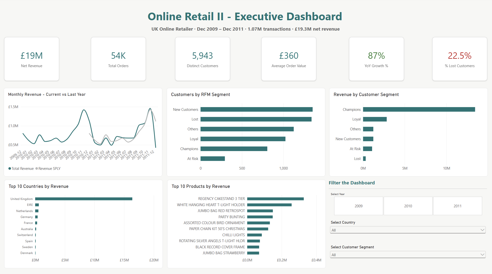
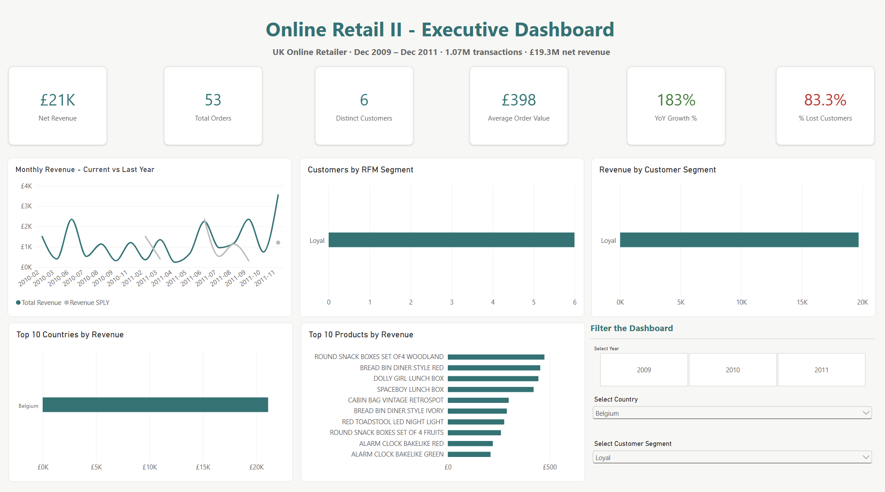

# Online Retail II Analysis

It is an analysis of 1.07M UK online retail transactions (Dec 2009–Dec 2011), from raw data cleaning in Python through to an interactive executive dashboard in Power BI.

## Business Questions
1. How is revenue trending, and what drives seasonality?
2. Which customers matter most, and who is at risk of churning?
3. Where (geography) and what (products) generate revenue?

## Tools
- **Python (pandas)** — data exploration, cleaning, feature engineering
- **Power BI** — data modelling (star schema), DAX, interactive dashboard, Power Query M (ETL and data transformation)
- **DAX** — 26 measures including time-intelligence (YoY, MoM, YTD) and RFM segmentation

## Dataset
[Online Retail II — UCI / Kaggle](https://www.kaggle.com/datasets/mashlyn/online-retail-ii-uci)  
1,067,371 rows, 8 original columns, 43 countries

## Approach

### 1. Data Exploration (Python)
The dataset exceeded Excel's row limit (~1.05M rows), so I worked in pandas. Key data-quality findings:
- 22.8% of transactions had missing Customer IDs
- Returns recorded two ways: 'C'-prefix credit notes AND negative quantities (3,457 "hidden" returns without the prefix)
- 12 non-product StockCodes (postage, adjustments, discounts) required separating from product sales
- Verified 'C' invoices = credit notes via their -£1.5M revenue impact

### 2. Data Cleaning (Python)
Engineered features for downstream analysis: revenue, return flags, transaction-type classification, and date components. Non-destructive approach, all rows retained and flagged rather than deleted.

### 3. Dashboard (Power BI)
- Power Query (ETL): loaded and shaped the data — corrected data types, normalised Customer ID formatting, and structured the query with tracked transformation steps
- Star schema: fact table (transactions) + date dimension + customer RFM table
- 26 DAX measures
- RFM segmentation classifying customers (Champions, Loyal, At Risk, Lost, etc.)
- Fully interactive: cross-filtering plus Year / Country / Segment slicers

## Key Findings
- Revenue grew 87% year-over-year, driven by strong November (pre-Christmas) peaks
- Champions are a small segment but generate the majority of revenue, while "Lost" customers are numerous but low-value
- 22.6% of customers are "Lost", which is a significant win-back opportunity
- UK dominates at ~85% of revenue. Ireland and Netherlands lead export markets
- Product mix varies sharply by market (UK: Christmas décor, Austria: parasols and gift boxes)

## Dashboard Preview

Filtering to a single market instantly updates every visual:

## Repository Structure
- `/notebooks` — Python exploration & cleaning
- `/powerbi` — Power BI file (.pbix), PDF export, dashboard screenshots
